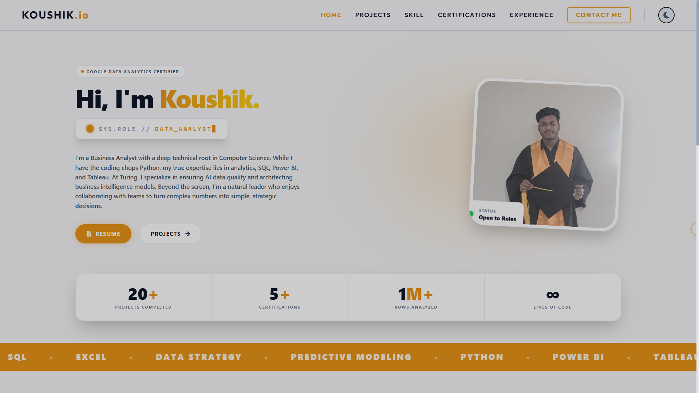

# Koushik Maity | Portfolio



A modern, highly-responsive, and premium portfolio website built for a Data and Business Analyst. Engineered with React and Tailwind CSS, this portfolio features a flawless dark/light mode, custom glassmorphism components, and subtle CSS animations to deliver an elite user experience.

## ✨ Features

- **Premium UI/UX:** Sleek typography (Outfit font), glassmorphism cards, and high-contrast glowing accents.
- **Flawless Dark/Light Mode:** Seamlessly toggles between an Apple-style Light Mode (`#F5F5F7`) and a deep, low-eye-strain Dark Mode (`#1D1D1F`).
- **Data Analyst Focused:** Dedicated pages for Projects (auto-sorted for Analytics), Technical Skills (Bento-grid style), and Google Certifications.
- **Custom Animations:** Hand-coded CSS keyframes for floating elements, infinite marquee tickers, and ambient text gradients.
- **Fully Responsive:** "Mobile-first" design ensures the site adapts perfectly to iPhones, iPads, and Ultra-wide monitors.
- **Polished Details:** Custom mouse cursors, glowing text selection, and dynamic scrollbars.

## 🛠️ Tech Stack

- **Framework:** React.js (Create React App)
- **Styling:** Tailwind CSS (v3)
- **Routing:** React Router v6
- **Animations:** AOS (Animate On Scroll) & Custom CSS Keyframes
- **Icons:** React Icons (FontAwesome)

## 🚀 Getting Started

To run this project locally on your machine:

1. **Clone the repository:**
   ```bash
   git clone https://github.com/koushikxy/koushikMaity.git
   ```
2. **Navigate into the directory:**
   ```bash
   cd koushikMaity
   ```
3. **Install dependencies:**
   ```bash
   npm install
   ```
4. **Start the development server:**
   ```bash
   npm start
   ```

## 📬 Contact
- **Email:** ksmaity21@gmail.com
- **LinkedIn:** [Koushik Maity](https://linkedin.com/in/koushik-maity)
- **GitHub:** [@koushikxy](https://github.com/koushikxy)

---
*Designed & Developed with ❤️ by Koushik Maity.*
